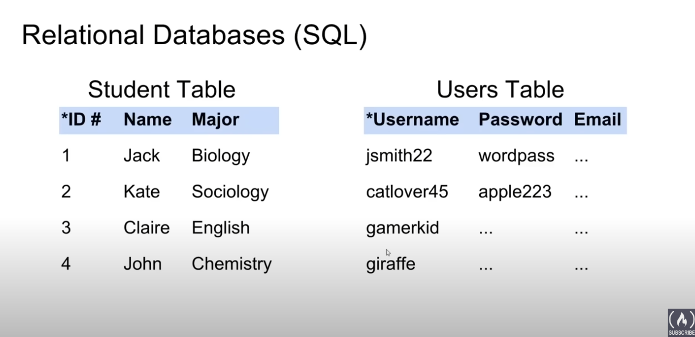
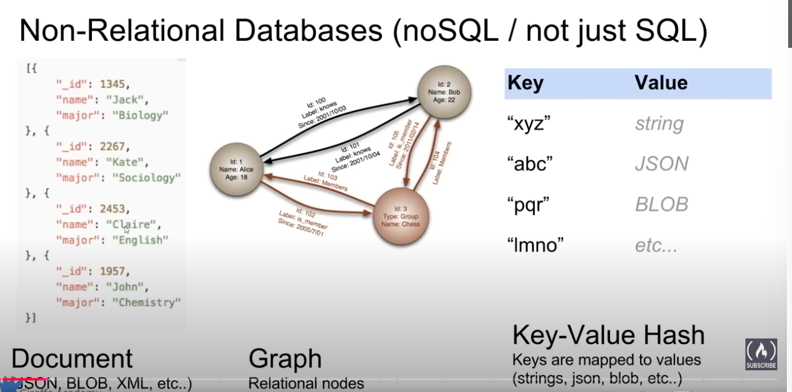
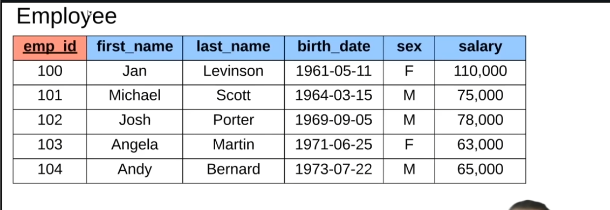
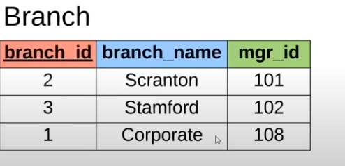
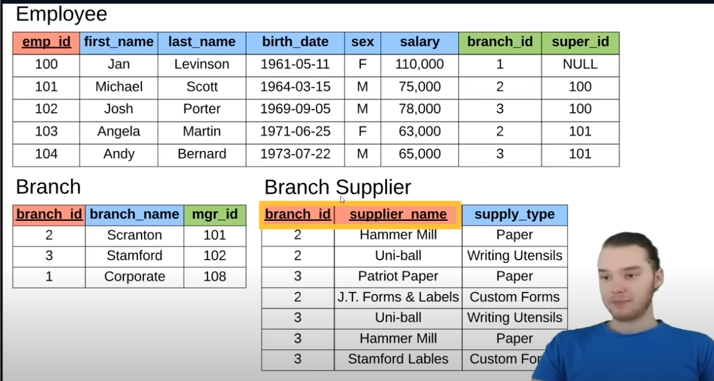

# Day 1 - 16/12/2024 - Ends at 23 minutes

# Whats a database - any collection of related inforamtion
- Phone book
- shopping list
- todo list
- fb user list

# Databases can be stored in different ways
- ON paper
- In your mind
- on computer
- powerpoint
- comment section

# DBMS (DataBase Management System):
- Special software program that helps user to create and maintain a database
- easy to manager large amounts of information
- handles security
- Backups
- Importing/Exporting data
- concurrency
- interacts with software applications

# CRUD - Create, Read, Update, Delete or Create, Retrive, Update, Delete
- 4 core operations of these DBMS 

# Types of Databases
- Relational DB (SQL Db's)
    - organize data into one or more tables
        - Each table has columns and rows
        - A unique key Identify each row
        - USES SQL language
        - eg: MYSQL, Oracle, PostgresSQL, mariaDB.....
        -

- Non-Relational DB (noSQL / not jsut SQL)
    - Organize data is anything but a traditional table
        - Key - value Stores
        - Documents (JSON, XML, etc .....)
        - Graphs
        - Flexible Tables
        - USES their own Language
        - eg: MongoDB, DynamoDB, firebase, apache cassandra....
        -

### Database Queries
- Queries are requests made to the database management system for specific information
- A google search is a query ....

# WrapUp

# Day-2 - 19/12/2024 - Ends at 1 Hour 31 Miutes

# Tables and Keys

- Vertical Column - Attribute
- Horizontal Row - enter in table or value of that particular attribute
- when ever make a table in RDB we always have a sepcial column that is a primary key
- Primary key uniquly defines/identifies a specific row in the table
- 

- Surrogate Key here is emp_id this is also a type of primary key
- No mappign to anything in the realy world -sorragate key

- Natural Key has mapping in the real world take example as using empl_ssn instead of emp_id

- Foreign Key - attribute we can store in a db table that can link us to another db table

- Foreign key stores the primary key of a row in of another db table

-  - branch_id is foreign key

-  - Branch table

- Foreign key helps us define relation ships between tables
- A table can have any number of foreign key but only one primary key

- 
- if a primary key is made by combining 2 or more coloumns that we call as composite key 

-  - final tables

# SQL Basics

- Structured Query Language

- used for interacting with RDBMS
- used for crud operation in Db's
- create and manage db
- all thing like admin tasks - security, user managerment, import/export etc...

- SQL impl vary between systems
    - Not all RDBMS follow the sql standard 
    - the concepts are the same but the implemantations may vary

- DQL (Data Query Language)
    - used to query database information
    - get information that is already stored there

- DDL (Data Defination Language)
    - used to define database schemas

- DCL (Data Control Language)
    - used for controling access to the data in the database
    - user and permission management

- DML (Data Manipulation Language)
    - Used for inserting, Updating and deleting from the database

### Queries

- set of instruction given to rdbms (Written in SQL) that tell RDBMS what information you want it to retrive for you
    - Basically we have TONS of data in the DB and its offen hidden in a complex schema and the goal is to get the data only we need.

    - eg:- <pre>SELECT employee.name, employee.age
           From employee
           Where employee.salary > 30000
           </pre>
 
# Basic DataTypes in SQL

- INT - Whole Numbers
- DECIMAL(M,N) - Decimal Numbers Exact Value M - total num of digits; N - no of dig after decimal point
- VARCHAR(l) - String of text of length l
- BLOB - Binary Large Object, Stores Large Data
- DATE - 'YYYY-MM-DD'
- TIMESTAMP - 'YYYY-MM-DD HH:MM:SS' used for recording when things happen in DB

# Create
- <pre>CREATE database akshay;</pre>
- <pre>CREATE TABLE - Reserved Words best to write in ALL CAPS </pre>
- <pre>
    CREATE TABLE student (
        student_id INT PRIMARY KEY,
        name VARCHAR(30),
        major VARCHAR(30)
    );
</pre>

- <pre> Another way
    CREATE TABLE student (
        student_id INT,
        name VARCHAR(30),
        major VARCHAR(30),
        PRIMARY KEY(student_id)
    );
</pre>

- SYNTAX - <pre>
                CREATE TABLE table_name (
                    column_name data_type (key if there),
                    column_name2 data_type2,
                    column_name3 data_type3,
                    ....
                );
           </pre>
- DESCRIBE table_name - syntax
- <pre>DESCRIBE student - gives all data about the table student</pre>

- DROP TABLE table_name - syntax
- <pre>DROP TABLE student - deletes the student table from the database </pre>

- ALTER TABLE table_name ADD column_name data_type
- <pre>ALTER TABLE student ADD student_gpa DECIMAL(3,2)</pre>

- ALTER TABLE table_name DROP COLUMN column_name
- <pre>ALTER TABLE student DROP COLUMN student_gpa</pre>

# DAY-3 - 20/12/2024 - Ends at 1 Hour 38 Minutes

# Inserting Data

- <pre>INSERT INTO table_name VALUES(value_1, value_2, value_3);</pre>

- It always fits as per the order of schema what order we created schema same order only we can enter values

- if any value missing we can do the following way

- INSERT INTO student(student_id, student_name) VALUES(2, 'kate'); the missing value will be filled NULL

- You cannot have duplicate entries for primary keys

- IF we want to bulk insert at a time we can follow this

- <pre> INSERT INTO table_name
        (Column1, Column2, Column3)
        VALUES 
        (v1,v2,v3),
        (v1,v2,v3),
        (v1,v2,v3);
    </pre>